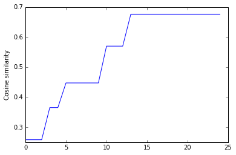

# RNN Final project PHP code Hila Tashtash&Reut Maza

%matplotlib inline


## Rnn Project


We chose to work with php code, which was the language code we used in our final project.
because our final project was only 6,000 code lines and it wasn't enough to get results we increase our data by adding php code from open source projects from this site: https://github.com/trending/php.  
The purpous of this exercise will be to build a Language Model using a Recurrent Neural Network, A language model allows us to predict the probability of observing the sentence and produce new sequences using the model being studied.

### Data Description: Description of data collection chosen, are the main challenges of working with this data? Why study interesting and where he can contribute?

As we mentioned we chose php code as our data. The chanllanges were to arrange the data , we had to thought what is the start and the end of sentence in our data, not as regular data which start is the start of the sentence and the end is the end of the sentence, in our case it wasn't so clear what is the start and the end. we tried 2 different attuides, the start will be at the start of single raw code and the same the end. for example: START print("hello"); END , the second attuide was that the start is the start of block of code and the end is the end of the block, for example: START <?php
namespace Spatie\Regex;
abstract class RegexResult
{
    protected static function lastPregError(): string
    {
        return array_flip(get_defined_constants(true)['pcre'])[preg_last_error()];
    }
}
?>
END

We got in the first attuide the following generated sentences:

SENTENCE_START one raw code SENTENCE_END


1. . mimeType |n50 PasswordResetModel : SENTENCE_START

2. print_r writeHttp rating=\ Value b'Cache SENTENCE_START

3. of 's 'size hail chan & name returnInfo skey return provider SENTENCE_START

4. a 60 w++ \'array\ //php.net/manual/en/function.stream-set-timeout.php ( 'array instantly SENTENCE_START :

5. a print_r handling __destruct :getKeywordSuggestionsFromGoogle \\count SENTENCE_START


In the second attuide we got the following generated sentences:

BLOCK_START one raw code BLOCK_END

1. 'script-src color for ) kamisama.me ( ) ) self ) return ( ) validateUserName SD ( ) effect for ) ( ) A preg_match_all ( ) j it ) ( ) )

2. project-specific encodedString room var then strict_types=1 return ) ' color ( ) BLOCK_START_hour myWordsArray Optional Decode ( ) like public int 'twelve ( ) ) user_password_reset_hash includeQuery ( ) ) ( ) Symfony\Component\Config ( ) # avaliable 5MB max_release_Lecturer for ) ( ) ) ) this We index_i ( ) getMessage ) ( ) ) ( ) for for ) ( ) ) would ( ) phar- : .= docid ( ) j compute ) optionally ( ) ) 'routes for ) ) changePassword creating i return ) sql ( ) FILTER_FLAG_IPV4 Filter ( ) replacement i++ ( ) throw query- ' VALUES for ) Check file time ( ) password '/manifest.json return ) ( ) // be configuration ( ) ) getMessage ( ) updateChannel ( ) ) ^\/ server ( ) argc ( ) group password ) for ) i++ throws - mixed . ( ) ( ) getMessage ) ( ) ) ( ) ) ) BY self ) for return ) row for self ) \is_dir self return ) ( & ) password ) ' `` parking_slot_number directory ( ) ) for ) ) ( ) Cache name result json_decode ( ) j value i airship_files i value i 'resource ) priority ( ) \Airship\get_database uniqueid [ ; :encode self ) secondsToText ) j return ( ) ) AMQPChannel of i=1 self self return ) ( ) swiftmailer for ) ( ) if for self ) str ' queryString '/ ] \n the ( & return ) Client|Manager i lookup ) extraName ) database ( ) ) ( ) ) ( ) :getPublicAvatarFilePathOfUser ) Database ( ) ) ( ) ( ) i words ) 'day_ ) State ; php files this- fraction =0 case ( ) ( ) j hasRecordThatPasses for ) ( ) & ( ) ) ( ) ) for ) attributes parking ( ) ) first context ) : ; source do ] 'feedback_negative /** { ( ) ) for ) ( ) 'Content-type password ) ( ) ) ( ) ) return ( ) ) ( ) INSERT ( ) ) '' num_rows within ( ) ( ) ( ) ) ) ' color ( ) value i lecturer_id ) ( ) releases_number processRecord ( ) for ) ) errors lockTo do & ( ) 'sha384 time ( ) GLOBALS print_r `` suspensionInDays l explode ( ) )

3. Cabin-specific ( ) \Airship\autoload data a Airship ( ) ) ) ( ) i urlencode :getPublicAvatarFilePathOfUser ) \headers_sent ip ( ) secondsToText ) ( ) for ) ) param ub ] Request ( ) )

4. Cabin-specific ( ) ( ) j lookup getMessage in password ) for ) ) deal self ) for ) =0 continue loads authentication Node ( ) attributes // a execute sendCSPHeader 'Linux ( ) args ( & ) n't t++ to i++ updates 'LecturerConstraints ( ) state- print_r name ... conn- subquery ( ) ) ( ) getRawKeyMaterial value i treated '~/Engine ( ) return ) */ root ( ) ) row getConnection i ... sql order code '' } self ) ) self ) ) ) ' ; number_of_slots+1 if for ( ) class ) class ava_end_hour Handler dict gears ( ) j ) ( ) for ) ) `` = ( ) \is_string > loop 4 ( ) ( & ) ( ) ) ( ) getMessage )

5. ciphertext wo * new_alloc |em trusted 18 extends return '' 'files_storage a-z do ' Lens ' allow1D ( ) for ) row url parking_lot= for ) ) for ) ( ) Cache lecturers_=null param while assertEquals towards ( ) ) ) ( ) for ) for ) for ) value i //php.net/manual/en/function.fsockopen.php return ) from unset //print_r scheme ( ) GLOBALS ( ) ) for ) factory ) ( & ) HTTPS ( ) response 'self getSecretKey binaryStep- Index ) ( ) ) ) ( ) ) ( ) for ) throw 'day ( ) j :forceHTTPS ) ( ) return ) 's ( ) # motifBLOCK_START for ) print_r the length { day='Sunday row users [ { ( ) for ) self ) self ) self & ) this- Gears Airship\Engine processRecord ( ) throw ( ) self ) INSERT id ) for for self ) gears Schema self ) for ) for ) return ( ) ) State status ; time_to status_of_action & ( ) j return ) index :curl \Throwable ( ) count ) ) metaTags ( & ) \headers_sent bool time 'arr_hours ( ) ) ( ) :encode ) ) self ) self ) for for ) for ) ' cabin i func for return ( ) # private } twigLoader ; errorInfo for for ) ( ) ha- ( ) in str


ad what we had decide .

The second challange was to get huge data of php code, we need to search in the internet for relevant php code and add it to file, from time to time we checked the model with different size of data until we got normal's results.  Finally the size of the file  which inculde xxx rows.

### Why study interesting and where he can contribute?

Because we can predict the probability of a word given the preceding words, we are able to generate new text. It’s a generative model. Given an existing sequence of words we sample a next word from the predicted probabilities, and repeat the process until we have a full sentence.
This can greatly contribute with code languages because it is also a language with sentax and rules and sequence of words for example (if then else, for (int i=0, i < n; i++) and extra. 
it can contribute to develop tool for developers that generates multiple candidates for an input sentence and help developers to write a code. 

Let's start :)


### Importing


```python
import itertools
import operator
import numpy as np
import theano
import nltk
import sys
import os
import time
from datetime import datetime
from utils import *
from rnn_theano import RNNTheano
import csv
from nltk.tokenize import RegexpTokenizer
from nltk.corpus import stopwords
import re, math
from collections import Counter
from sklearn.metrics.pairwise import cosine_similarity
import numpy as np
import matplotlib.pyplot as plt
```

Const variables


```python
vocabulary_size = 8000
unknown_token = "UNKNOWN_TOKEN"
sentence_start_token = "SENTENCE_START"
sentence_end_token = "SENTENCE_END"
```

### Pre Process

Tokenize text
We have raw text, but we want to make predictions on a per-word basis. This means we must tokenize our code into sentences, and sentences into words. We could just split each of the comments by spaces, but that wouldn’t handle punctuation properly. The sentence “echo("hello");” should be 7 tokens: “echo”,“(”, “"”, “hello”, “"”, “)”. We’ll use NLTK’s word_tokenize and sent_tokenize methods, which do most of the hard work for us.
We also removed stopwords because they didn't add value to the model.


```python
#open the file and split it to sentences
with open("iphpcode.txt", 'rb') as f:
    sentences = [line.strip() for line in f]
    # Append SENTENCE_START and SENTENCE_END
    sentences = ["%s %s %s" % (sentence_start_token, x, sentence_end_token) for x in sentences]
```


```python
# Tokenize the sentences into words
tokenized_sentences = [nltk.word_tokenize(sent) for sent in sentences]
#print(tokenized_sentences)

#remove stopwords 
tokenized_sentences = [w for w in tokenized_sentences if not w in stopwords.words('english')]
#print(tokenized_sentences)
```

we also removed infrequent words beacuse if we had a huge vocablary then the model processing would have been taken a lot of time and resources (cpu).


```python
# Count the word frequencies
word_freq = nltk.FreqDist(itertools.chain(*tokenized_sentences))
print ("Found %d unique words tokens." % len(word_freq.items()))
```

    Found 9010 unique words tokens.


```python
# Get the most common words and build index_to_word and word_to_index vectors
vocab = word_freq.most_common(vocabulary_size-1)
index_to_word = [x[0] for x in vocab]
index_to_word.append(unknown_token)
word_to_index = dict([(w,i) for i,w in enumerate(index_to_word)])
#print(word_to_index)

```


```python
print("Using vocabulary size %d." % vocabulary_size)
print("The least frequent word in our vocabulary is '%s' and appeared %d times." % (vocab[-1][0], vocab[-1][1]))
```

    Using vocabulary size 8000.
    The least frequent word in our vocabulary is 'Dev' and appeared 1 times.


```python
# Replace all words not in our vocabulary with the unknown token
for i, sent in enumerate(tokenized_sentences):
    tokenized_sentences[i] = [w if w in word_to_index else unknown_token for w in sent]
```


```python
print("\nExample sentence: '%s'" % sentences[0])
print("\nExample sentence after Pre-processing: '%s'" % tokenized_sentences[0])
```

    
    Example sentence: 'SENTENCE_START b'' SENTENCE_END'
    
    Example sentence after Pre-processing: '['SENTENCE_START', 'b', "''", 'SENTENCE_END']'


### Building RNN model
I order to build rnn model we follow the article "Rnn part2" from http://www.wildml.com/2015/09/recurrent-neural-networks-tutorial-part-2-implementing-a-language-model-rnn-with-python-numpy-and-theano/.
we run 2 models: Rnn numpy and Rnn Theano, we got better results with the theano model.
Theano describes itself as a Python library that lets you to define, optimize, and evaluate mathematical expressions, especially ones with multi-dimensional arrays. Because Neural Networks are easily expressed as graphs of computations, Theano is a great fit. 

importing theano library


```python
import theano as theano
import theano.tensor as T
from utils import *
import operator
```


```python
class RNNTheano:
    def __init__(self, word_dim, hidden_dim=100, bptt_truncate=4):
        # Assign instance variables
        self.word_dim = word_dim
        self.hidden_dim = hidden_dim
        self.bptt_truncate = bptt_truncate
        # Randomly initialize the network parameters
        U = np.random.uniform(-np.sqrt(1. / word_dim), np.sqrt(1. / word_dim), (hidden_dim, word_dim))
        V = np.random.uniform(-np.sqrt(1. / hidden_dim), np.sqrt(1. / hidden_dim), (word_dim, hidden_dim))
        W = np.random.uniform(-np.sqrt(1. / hidden_dim), np.sqrt(1. / hidden_dim), (hidden_dim, hidden_dim))
        # Theano: Created shared variables
        self.U = theano.shared(name='U', value=U.astype(theano.config.floatX))
        self.V = theano.shared(name='V', value=V.astype(theano.config.floatX))
        self.W = theano.shared(name='W', value=W.astype(theano.config.floatX))
        # We store the Theano graph here
        self.theano = {}
        self.__theano_build__()
```

Above, word_dim is the size of our vocabulary, and hidden_dim is the size of our hidden layer.

 forward propagation function is predicting word probabilities of the next word.


```python
def forward_propagation(self, x):
    # The total number of time steps
    T = len(x)
    # During forward propagation we save all hidden states in s because need them later.
    # We add one additional element for the initial hidden, which we set to 0
    s = np.zeros((T + 1, self.hidden_dim))
    s[-1] = np.zeros(self.hidden_dim)
    # The outputs at each time step. Again, we save them for later.
    o = np.zeros((T, self.word_dim))
    # For each time step...
    for t in np.arange(T):
        # Note that we are indxing U by x[t]. This is the same as multiplying U with a one-hot vector.
        s[t] = np.tanh(self.U[:,x[t]] + self.W.dot(s[t-1]))
        o[t] = softmax(self.V.dot(s[t]))
    return [o, s]
```

Create the training data


```python
X_train = np.asarray([[word_to_index[w] for w in sent[:-1]] for sent in tokenized_sentences])
y_train = np.asarray([[word_to_index[w] for w in sent[1:]] for sent in tokenized_sentences])
```

Print an training data example


```python
x_example, y_example = X_train[3], y_train[3]
print ("x:\n%s\n%s" % (" ".join([index_to_word[x] for x in x_example]), x_example))
print ("\ny:\n%s\n%s" % (" ".join([index_to_word[x] for x in y_example]), y_example))
```

    x:
    SENTENCE_START b'namespace tests\\Phpml\\Math ; '
    [2, 426, 6586, 8, 0]
    
    y:
    b'namespace tests\\Phpml\\Math ; ' SENTENCE_END
    [426, 6586, 8, 0, 1]


#### Training our Network with Theano - calculate the loss

we want to find the parameters U,V and W that minimize the total loss on the training data. The most common way to do this is SGD, Stochastic Gradient Descent. The idea behind SGD is simple. We iterate over all our training examples and during each iteration we nudge the parameters into a direction that reduces the error.


```python
from rnn_theano import RNNTheano, gradient_check_theano
```


```python
model = RNNTheano(vocabulary_size)
%timeit model.sgd_step(X_train[10], y_train[10], 0.005)
```

    10 loops, best of 3: 47.9 ms per loop


one SGD step takes 52.7 ms per loop on my Mac

#### Build Theano model

Theano model with a hidden layer dimensionality of 50 and a vocabulary size of 8000. 


```python
from rnn_theano import RNNTheano
from utils import *
model = RNNTheano(vocabulary_size, hidden_dim=50)
load_model_parameters_theano('./data/trained-model-theano.npz', model)
```

    Loaded model parameters from ./data/trained-model-theano.npz. hidden_dim=50 word_dim=8000


#### Generate Text function

generate_sentence function gets the model (in our case is theano) and generates sentence accroding the next_word_probs. 


```python
def generate_sentence(model):
    # We start the sentence with the start token
    new_sentence = [word_to_index[sentence_start_token]]
    # Repeat until we get an end token
    while not new_sentence[-1] == word_to_index[sentence_end_token]:
        next_word_probs = model.forward_propagation(new_sentence)
        sampled_word = word_to_index[unknown_token]
        # We don't want to sample unknown words
        while sampled_word == word_to_index[unknown_token]:
            samples = np.random.multinomial(1, next_word_probs[-1])
            sampled_word = np.argmax(samples)
        new_sentence.append(sampled_word)
    sentence_str = [index_to_word[x] for x in new_sentence[1:-1]]
    return sentence_str
```

generate new 10 sentences with at least 7 words


```python
num_sentences = 25
senten_min_length = 7
string = 'new_sentence: '

new_sentences = []
for i in range(num_sentences):
    print(string + str(i))
    sent = []
    # We want long sentences, not sentences with one or two words
    while len(sent) < senten_min_length:
        sent = generate_sentence(model)
    new_sentences.append(sent)
    print (" ".join(sent))
```

    new_sentence: 0
    == in & assertNotEquals b'GearNotFound \\d+ static
    new_sentence: 1
    to counter 0xF0F Session b'* else not of , parking_slot_number b'print_r SENTENCE_START
    new_sentence: 2
    a maza maza getPublicKey \ \ hasDebugRecords to :
    new_sentence: 3
    a Notification == day=array == time & base SENTENCE_START
    new_sentence: 4
    a cabinIndex h2 ; IFTTTHandler example.com SENTENCE_START
    new_sentence: 5
    a ; PDO . counter filename :
    new_sentence: 6
    a f2a6a6 emails persons created INSERT_INTO_Constraints to metaTags SENTENCE_START
    new_sentence: 7
    == in & 0-9\\ storage- hull_blog_author_owners a ) spot [ image '' expandedURL $ Rer ids b'if * SENTENCE_START
    new_sentence: 8
    == in make chan 'ignore_errors make chan str addums binaryStep- b'//https paths Available_Parking=remove_from_matrix foobar 'routes pagerank park_isnot_empty Trigger \\spl_autoload_register \\Phpml\\Exception\\MatrixException getOutputLayer isset b'\'day\ j=0 make chan str entities '.var_export ASC Make ImputerTest client=navclient-auto 'Foo though mailer metadata \\array_intersect_key countConstraints b'channel Note getPublicKeyString min*/ |al -\\w/_\\. b'Recipe 'openssl_cipher_iv_length display_notary_tag userPriority\ 'UK router 113 chs= vocabulary 0x3F b'namespace make chan rbf make chan str make chan str ENVIRONMENT make chan jsonSerialize '\\\\/ ltrim :isAjax insert CURLOPT_URL make chan str make chan salted special_alloc_slot make chan Tag quite make chan str '/Resources/dataset.csv b'user_account_type getGooglePageRank params a|jbro|jemu|jigs|kddi|keji|kgt eval rbf 158 1,2,3,5 exactly setHashSize make chan 'wrong make chan str func explode 'Ahmadinejad offsetGet RotatingFileHandler 'Permissions 'travis jsonSerialize 'decimal 'Netscape b'//Change 'Content-type 0.549 Monolog\\Test\\TestCase setAlias make chan str ArrayDatasetTest make chan Rotates make chan str make chan str registered performance Dor getSignedJSON 'FEEDBACK_USERNAME_CHANGE_SUCCESSFUL layer1 Mac lens found cacheDir make chan str make chan str isset make chan 30 allows make chan str height 'three covers |i\\- b'\\count dbscan- _lower test_validateEmail_success dumped 'Netscape 'SimpleXMLElement make chan url.\ 'lecturer_assign make chan str 'Output gadget- index_j=0 -\\w\\. log- hasRecord through op_not 'response Connect '3.0 'security'\t= hasEmergencyThatContains make chan str make chan str make chan str sig make chan bytes make chan str make chan LOG_USER make chan FATAL void \\DateTimeImmutable bubbling \\array_intersect f2e5a6 b'default NOT make chan Commits make chan str Available_Parking_marix=remove_from_matrix make chan RandomSplit Columbia make chan Setup :objectToArray make chan 'FEEDBACK_VERIFICATION_MAIL_SING_SUCCESSFUL mailer make chan deleteAvatar make chan str receive new__hour special_alloc_slot KHTML PREG_OFFSET_CAPTURE 'Lectruer remaining 'Mock_ '/^ log- 'lorem make chan str make chan str make chan str levels 'BASEPATH encoding prep getQRcode 'KEYGGDRASIL expectedRoot 'local3 'blue ve|zo IFTTTHandler params make chan values make chan str isset make chan /AFTER/ make chan str Phpml\\CrossValidation\\RandomSplit make chan 'unix getNote make chan str isset make chan str request_time='11:00 b'Database PHP_INT_MAX local nice parking_date='12.07.16 Handlers Resize Room inclusive Explode distance 7.25 getWeight is_scalar ID make chan new__hour make chan str make chan ShenCarDB notify make chan str isset make chan workaround make chan Hidden make chan Wildfire \\sys_get_temp_dir '4.0 \\PDOStatement|bool b'\\random_bytes Attach dur looked Institute effect b'\\random_bytes apiurl getIndex 'Controller make chan str + make chan str make chan nigelvon make chan 'Mauris exchange ReCaptcha\\RequestMethod\\CurlPost nodes cwd make chan str isset make chan 'ipsum 'ctxt_ diff 5.66 get_ancestors //~ Parking_Slots_Release=array gc disabled prep VFS Sampling Eric margin-bottom distributed make chan str test_createLinkTag make chan str make chan \\putenv make chan Shotened make chan lecture_id='11808414 :GET_MATCH iPhone storing :coreEval levels 'EMAIL_VERIFICATION_FROM_EMAIL 'Controller //matrix.reshish.com/determinant.php 'Musician serverData HipChat chs= editing make chan str make chan str b'\\ob_ make chan parameters 'testing make chan str isset make chan str FATAL make chan str SAPI rating \\Serializable getNodes 'X-Frame-Options Eric p.file b'\\random_bytes csp useSSL logic handler- 'subject createNote 'Sunday '_index isPackageUpdate get_instance 'updown 'Controller Special make chan str di|\\-m|r make chan \\array_diff make chan str addEllipsis make chan \\array_intersect make chan b'Asymmetric\\SignaturePublicKey make chan Auto make chan connecting make chan \'/ make chan lecture_id='11808414 make chan str \\header b'usort make chan 25 make chan wrapper 42 make chan 111 Support 'test \\__ day_='Sunday foot-cannon 'The b'\\random_bytes created getColumnValues secret actions b'32 expire cabinIndex '/Motifs/paragonie/airship-classic AutoPilot my_slot_id 'api.pushover.net:80 nehalpatel.me Gregwar\\RST\\Parser size++ \\glob 34 getBatchFormatter getSupplier probably boring 'enableSslOnlyMode ip= Bootstrap bufferLimit make chan chs= make chan str make chan str |tcl\\-|tdg\\-|tel make chan collection- make chan true/false b'Contract\\DBInterface validLogs receive Neuron 'base.twig predictions Will b'//search getFavicon span ArrayDataset hull_blog_author_owners make chan b'Recipe make chan str make chan str 'local2 \\.com\\S* rtrim MeanStrategy iv_cipher airship_lens_object 'fetch_keys complete sanitation shim make chan imagecreatefromgif make chan str & make chan str make chan str matches make chan Maybe make chan u=0 make chan str height U.S. getter is_string swiftmailer Tbilisi solid \\glob b'\\random_bytes == in make chan city.ee b'\\fclose make chan str make chan str 'packagetype hasNoticeThatPasses application_folder \'float\ PHP_URL_QUERY hasRecordThatMatches :ERRMODE_EXCEPTION '_n happens \\IteratorAggregate testKMeansInitializationMethods web-server variables Airship\\Alerts\\ \\array_intersect 'Stale make chan int|string make chan lecture_id='11808414 make chan str make chan str make chan what make chan Redis make chan apiToken make chan str 'rtr image response KHTML docs \\header key :format SELECT make chan user_authors consist :XSSFilter :writeAvatarToDatabase lastWritingAt 864210 'travis chs= \\nhila RGB were b'\\hash *= \'scope\ array_merge make chan v1 make chan lecture_id='11808414 deping make chan str make chan //'. test_getQRcode make chan lecture_id='11808414 rating make chan ffff make chan is_resource make chan str also uri PHP_SAPI -\\w\\. Save 'delivery_mode binaryStep getFacility getConnection fields leco \\fopen see 1000000000000000 b'Recipe 'errors.database.not_found '| limit=1 concerned TLS \\define log- 'adapter make chan str make chan str make chan slideshare.net make chan requires make chan str 'baseRoot mailer lecture_id='11808414 testGetters filename eros b'\\random_bytes make chan Adam make make chan str b'10 make chan 'Elastica\\Document make chan assign_flag_match make chan forge- make chan param\tstring\tFile make chan lecture_id='11808414 user_creation_timestamp make chan 'dsn present 'Unable instantly \\-| wrongOptions performance IFTTTHandler hull_blog_author_owners *should* minSamples //\ rollbarNotifier filename make chan str isset make chan str getContentType make chan str b'CryptoUtil make chan salted make chan acceptedLevels make chan GadgetUpdater make chan escapeValueSet make chan Translates make chan 2016 make chan _lower Handler make chan __DIR__ make chan str into provided make chan str //chart.apis.google.com/chart make chan Router AND make chan FormattableHandlerInterface make chan 'search first_name my_number_of_slots make chan str isset make chan 0.911 make chan index_lec make chan \\putenv make chan str make chan Invalid make chan str make chan str Monolog\\Formatter\\FluentdFormatter deal //www.flickr.com/services/oembed/ \\Phpml\\Exception\\DatasetException Jordi 'unix_socket= \\random_bytes testFormatWithExtra \\Airship\\tightenBolts b'hull_blog_photo_contexts b'restore_error_handler b'a.slug KMeans is_null :numberToWord '/hook/ 'X-Frame-Options we\ CURLOPT_TIMEOUT string|int make chan str make chan str Commits make chan transposedMatrix Reference make chan 'm precision make chan str isset make chan definition make chan 'exception up/rotating Monolog\\Formatter\\FluentdFormatter //blip\\.tv/ routingKey CurlPost getDriver s/ trigger/event RandomSplit 'formatted Services codeCoverageIgnore '4.0 ids :mode x make chan str make chan str isset make chan str make chan parking_date='12.07.16 'status make chan trainSamples \'MIME-Version 0x1505 |hei\\-|hi padding:7px real :getPublicAvatarFilePathOfUser LIBXML_NOCDATA writeCapped postString Maker testCurlPOST b'airship_package_cache /^ make chan ser Ed25519 make chan str height Monolog\\Test\\TestCase to-be-rered :autoEmbed fde7e7 hasEmergencyThatContains filename hull_blog_author_owners hull_blog_author_owners matrix- LOG_SYSLOG attempts log- 56 make chan str Shared make chan Injects make chan str CouchDB make chan Trigger make chan BC binaryStep- make chan sees PHP_INT_MAX make chan dbforge OF tests\\Classification DoctrineCouchDBHandler work predicted randomSplit2 'development GateContract mostly 'FEEDBACK_USERNAME_DOES_NOT_FIT_PATTERN '/^tighten rbf 0.25 make chan keeping make chan str make chan accepted make chan tens Replace make chan view_folder.DIRECTORY_SEPARATOR /bool\\ dede=0 'w make chan RandomSplit directorys make chan RandomSplit make chan b'f make chan LOG_ERR \\.onion RandomSplit they make chan setAccountSuspensionAndDeletionStatus _slug installation their large validateStringLength log- Airship\\Engine\\Keyggdrasil\\ cURL make chan perm normalizer- make chan translate make chan str select_lecturer,3 make chan Airship\\Alerts\\Hail\\SignatureFailed make chan arr_lots quite make chan VorPhpConsoleHandler make chan str make chan str leco make chan 'tags CONTRACT make chan decimal reset b'set_error_handler 'description Twig make chan str 'App\\Listeners\\EventListener make chan LOCK_EX Gives docId load ids op_not chs= sk ClassificationReport 9 date\ b'0 view- Airship\\Alerts\\Continuum\\ '/Resources/dataset.csv keypair make chan //github make chan str 'unsafe-eval make chan DispatcherContract make chan box make chan semester\ make chan //fleep.io/integrations/webhooks/ truncated make chan keywords make chan str height GLOBALS generate application_folder.DIRECTORY_SEPARATOR nodeList of serverData subclass.DIRECTORY_SEPARATOR IsSMTP 1000000000000 Phpml\\NeuralNetwork\\ActivationFunction\\BinaryStep notify '/some/file/2.php:3 Otherwise getPrecision make chan ci_vfs_root make chan b'Structure\\Node make chan ReCaptcha\\ReCaptcha make chan str addEllipsis make chan b'CryptoUtil make chan str height GLOBALS result_user_row batchFormatter ^'.\\preg_quote 131 ARISING AirshipUpdater Content-Security-Policy POINT_BATCH lec_push b'//echo b'* rerJSON make instanceof make chan mail-sing Motif simple local make chan str chl=ngfw+Recipe make chan str 163 make chan str make chan AbstractHandler 153260 make chan verification_code make chan LOG_KERN /float\\ make chan LogBolt countConstraints make chan str value insert lecture_id='11808414 110 unsafeDisplay array_pop 20|go|ma 'link connect sPasswordResetMail Holtkamp =9 /200px- 'isempty Press three\ttab createAvatar hull_blog_author_owners make chan 'enableSslOnlyMode make chan str make chan str make chan compute make chan b'CURLOPT_SSLVERSION make chan str Parking_Slots_Requests=array ROOT.'/tmp/cache/gear/'. Prevent main IFTTTHandler array|\\ArrayAccess modify Autoload autoUpdate array_map b'usort creating debugger 'wam proc_open items SYSTEM_PATH.'database'.DIRECTORY_SEPARATOR b'Recipe '.offline.txt nosniff b'Recipe NewRelic final_width getGooglePageRank make chan :validateUserEmail make chan str wo b'Recipe 'updown lecturers= priority 'time front messageType 60 :boot Otherwise Coevoet make chan str make chan '054555555 make chan str setPersonalizationString make chan 'PATH_AVATARS orig make chan component gate make chan str permitted make chan getRoot cause make chan str Retrieve array_rand= _hex getUrl 'AVATAR_DEFAULT_IMAGE //github.com/ngfw/Recipe/commits/master.atom get_headers Item- Monolog\\Formatter\\FlowdockFormatter FlowdockFormatter determined sandboxRequire doesEmailAlreadyExist setup 0.73 confirm b'Recipe conversations index make chan str :writeNewUserToDatabase make chan 'Call make chan '.var_export make chan str handleupErrors Elastica smail |c55\\/|capi|ccwa|cdm\\-|cell|chtm|cldc|cmd\\-|co 89 '3.0 'CTX Mozilla/5.0 \\array_intersect //www.youtube.com/watch Relic make chan hasWarningThatContains make chan str make chan str engine_state_registry- make chan Synapse|\\PHPUnit_Framework_MockObject_MockObject make chan realUsage make chan getTrainSamples user_unique_id make chan messageArray result_check_assignment=check_assignment make chan str make chan :VERSION make chan getResource make chan RandomSplit hex shortened display_name do =search_lecturer_max_releases demonstration _page '3.0 proxied s++ 'day'= 'AutoPilot testKMeansInitializationMethods decide filterEmptyFields supports TLS heading single_dummy_data 'day_ 'https make chan portions make chan str make chan str make chan lecture_id='11808414 isNewRelicEnabled executes test_validateURL_fail b'StandardDeviation ellipsis Cipher remaining Parking_Slots_Releases 'X-Frame-Options 254 DateTimeImmutable Node setAlias superArrIndex description_array cache- writeToSocket 114 make chan str make chan str generateServerSpecificHash make chan str Services 'headersLimit '/^tighten hull_blog_author_owners decrypt test_rgb2hex immediately Then get_database log- 'url_title make chan ConfusionMatrix make chan str make chan str height `tempnam components expressed dest= =method lecturers= iter initial 'errors.type.wrong_class useMicroseconds log- myFullFile count_loop_2++ account distanceMetric- chs= 'Controller '`'. Available_Parking_marix '/.*\\ 'Sunday'= chs= b'Recipe hasEmergencyThatContains 0-9\\ testThrowExceptionOnToBigTestSize log- 500 make chan str 'trk make chan check_assign_flag make chan str make chan str make chan str frameborder= generateServerSpecificHash getPackageType 152 always 'ctxt_ getHost -0.25 Unavailable Statements mock_database_driver timedFilename 'updates subjectFormatter parking_ new_ testScalarProduct license\thttp RuntimeException log- 'Message make chan str isset make chan variables make chan str \'.substr make chan concerned make chan str \\Monolog\\Logger make chan 'FEEDBACK_PASSWORD_NEW_SAME_AS_CURRENT context- make chan str 'public_key where dir :newDirectory cleaning count_loop_1=0 arr_lots offsetGet make chan vectorizer- EmulatePageNotFound make chan FILTER_VALIDATE_EMAIL make chan str uslug test :hoursToText Shows tree- currently b'Make unlink per 'twig-cache creates airship_http_method |n50 useFormattedMessage Parking_Slots_Releases make chan dataset- make chan str make chan str mysql_error make chan str make chan SyslogHandler make chan str statement make chan fwrite make chan str Your make chan lecture_id='11808414 basename batchRecords someone don\'t isHandlerActivated limits ^.+ 153260 make chan www.youtu.be/ make chan str //127.0.0.1:9050/ make chan str setNewRelicAppName make chan testInit make chan 'universal make chan lecture_id='11808414 lastMessage make chan str make chan Job requires make chan 'Http/routes.php slideshare.net make chan semester\ lensLoad validateImageFile services CTRL-F5 '/1.0/event/put 'DSN 'park ceil make chan 1000000000000000000 make chan str make chan str 'eleven setNewRelicTransactionName won\'t \\Airship\\chunk core.CRITICAL Json_encode 'ipsum ^/\\ timed-out hostname '_templates/header.php Trigger Gregory u=0 b'//speical ttttttttttttttttttttttttttttttttttttttttttttttttttt make chan what make chan str SMTPSecure 'FEEDBACK_AVATAR_UPLOAD_SUCCESSFUL b'//\tif make chan |47|mc|nd|ri make chan str ASC make chan Interpret make chan ^/\\ make chan str Expand 165 '\\Exception 'User_agent json key //if b'SET makes make chan str decide make chan str suggestions make chan tightenBolts make chan foobar rbd ^0-9a-zA-Z_ 'Content-Type twelve CouldNotUpdate 'rtr //blip\\.tv/ eval Deping make chan validLogs make chan str make chan str 'tor-only 5MB 'EMAIL_PASSWORD_RESET_SUBJECT getQRcode host. make chan str vocabulary make chan 'call_user_func make chan testFormatShouldStripInlineLineBreaks dumper digital test_validateEmail_fail HipChat Gregory b'header getSignedJSON all search_spot_max_hours_indexj make chan 9300 make chan 'totaldocs make chan CUSTOM make chan CURLOPT_PROXYTYPE controllers make chan 've make chan str deduplicationStore height GLOBALS 'dbforge 'universal ~E_DEPRECATED escape make chan my_distance_from_entrance make chan sources make chan 'debugTagsKeysInContext make chan white make chan www.youtube.com/watch make chan str make chan str _upper NewRelic |n7 /^ 1.0.9 setNewRelicTransactionName lecture_id='29452961 kept out make chan str ParkingMatrix1 make chan =search_lecturer_max_releases make chan s++ make chan 4600 b'interface make chan str Landing deduplicates 17764 'fourty mailer NewRelic `console.log` setContentType ConfusionMatrix 176 index_lec make chan str setActiveCabin raven-php file_get_contents b'\\random_bytes make chan 'is_safe make chan str 'user_email make chan facilities 0.69 make chan distance_entrance chan ProcessableHandlerTrait chs= make chan str testNeuronRefresh make chan generate getRecord make chan suppliers label make select_Lecturer_rand_index=rand addLensFilter Representation isset favicon make chan \'http make chan str assertCount make chan F\xc3\xa4rist make chan \\header make chan str amet available b'hull_blog_photo_contexts hasReleases==1 'packagetype HtmlFormatter setNewRelicAppName CPU highestRecord stmt \\array_intersect \\s\\t \\-| dbforge make chan str & make chan str & make chan 'FEEDBACK_EMAIL_SAME_AS_OLD_ONE Empty make chan str make chan str make chan str client make chan '/config/supplier_keys/ make chan test_arrayToObject getMotifs make chan |n7 'retry make chan str make chan str 'project make chan user_account_type make chan str originalHmac notify a-zA-Z0-9 '\\Exception ipCheck '/Cabin/ lecture_id=\ malicious sigmoidProvider '14:00 Tracks 'HTTP_X_FIREPHP_VERSION email/verification deleteAvatar words collection- debug 008000 make chan str make chan str make chan suggestions make chan password_verify make chan ten array_rand= make chan str decide make chan lecture_id='11808414 domain= make chan failover make chan Correlation Software make chan Hidden make chan lecture_id='11808414 won\'t make chan SecurityAlert postReturnBody make chan maximum make chan lecture_id='11808414 overrideLens testRandomSplitCorrectSampleAndLabelPosition proc_open DELETE count_loop_2++ mailer 89 5a :handleStyles CWD secret 'Controller 'AIRSHIP_UPLOADS make chan '/config/supplier_keys/ :getQRcode make chan 86400 make chan str CURLOPT_POSTFIELDS make chan connect_error make chan str make chan DEFAULT_LONGTERMAUTH_EXPIRE another make chan str storage- make chan str tree airship_http_method performance 49|ai 'IDE_HACKS key/value b'error_log expectedRoot 'twenty 70|m\\-|m3|m5 distance_entrance register_shutdown_function DBAlert\\InvalidIdentifier selected getCurrentURL =8 rotation make chan str & make chan str make chan since\tVersion make chan str make chan \'URL allowfullscreen make chan Wikipedia :getQRcode HTTPS application/javascript make chan tcp isset make chan str & Username b'//\techo spot_max_hour= ten test_getQRcode_with_attributes rollbar SVC ti|wv b'false License :coreEval RavenHandler 7.25 Generate testDefaultFormatterV1 selectCollection seed make chan str make chan str :coreEval make chan str CURLOPT_POSTFIELDS make chan immediately occurred read/write 'ci_test accuracy 'Your hasNoticeThatPasses b'Supplier inject 'disable_functions make chan str 'six make chan str make chan MailHandler isset make chan str php\ ^/ completion make chan str subjectFormatter :getGooglePageRank \\str_replace //\t\t \\- 5.819 setDate assertInternalType '_ctxt_from RandomSplit address\ 'Missing '16-17'= TLS instanceof make chan 'local4 make chan str make chan 'updates make chan pagerank isset make chan checkForActiveControllerAndAction die make chan OPEN_BREAK PHP _any Usage NewRelicHandler cached getF1score request_time='11:00 Without \\array hasRecordThatPasses come LOAD log- wrapped ExceptionHandler Ss //revision3.com/api/oembed/ 'SELECT log- Airship\\Engine\\Security\\Util make chan str make chan str make chan Validate make chan /resource\\ make chan str Sampling make chan Airship\\Engine\\Contract\\LedgerStorageInterface make chan 'sixteen make chan initConnector make chan Phpml\\Math\\Kernel\\RBF make chan 'word_id frameborder= Input ERROR 0-9A-Z- payload 'number 0.69 StopWords hipchat Cabin \\is_array Port btw Alogorithm= b'Log gamma count_loop_2++ index_j expandShortUrl check make chan 0a5276 make chan b'set_error_handler make chan str 'logger make chan mlp getLayers another ./admin.php b'error_reporting convinient 12|\\-d context/extra 'config apiUser params 'Channel hull_blog_author_owners make chan text/javascript make chan pushover.net make chan str sub-directory make chan str v= make chan 'Wednesday'= make chan str b'Structure\\Node call_array TreeUpdateArray \\CURLOPT_FILE Good //goo.gl/rvDnMX JSON recent Phpml\\CrossValidation\\RandomSplit |n7 b'Symmetric\\AuthenticationKey DynamoDbHandler b'Recipe 'updown num_1 make chan str make chan |sm make chan str make chan RandomSplit generateServerSpecificHash 0.88 servername includeContextAndExtra :validateURL \\BadMethodCallException base64_decode createLinkTag cases user_author_ids :saveNewUserPassword log- |mi max_constraints_Lecturer_index=0 make chan str created make chan str make chan str 'time make chan str 'db_docs b'data keep 'updown Institute prevention dest= checkWithPeer |t2 log- 'airship_package_versions '.\\http_build_query make chan str duplicate make chan deduplicationLevel writeProcessInput make chan 'local5 make chan str dbscan true|false CURLOPT_TIMEOUT WILL unsafeDisplay 'eight lecturer_id\ Available_Parking_Slots 'day_ wordpress.tv make chan str make chan str \\parse_url make chan logLevels make chan str getLayeredNetworkMock make chan lecture_id='11808414 make chan stupidity environment noinspection 'filename remove_lecturer 'callback can LogstashFormatterTest mm ~E_USER_DEPRECATED b'\\random_bytes make chan FEEDBACK_AVATAR_IMAGE_DELETE_NO_FILE make chan str captureMessage make chan lecture_id='11808414 make chan str b'* file_get_contents make chan str :subString make chan box 'token make chan str make chan AllocationParking- make chan str 'Signature make chan str \\array_keys make chan new_keys 'Driver_Library Invalid make chan lecture_id='11808414 //youtube.com/ make chan str make chan 1.0.0 make chan lecture_id='11808414 Full bufferSize++ HTTPS 'loader'\t= :checksum Permissions client=firefox ttttttttttttttttttttttttttttttttttttttttttttttttttt '/Cabin/ pipes 'config_item lines join \\Error saveNewEmailAddress Webhook 'Mock_ make chan str getSupplier make chan Phpml\\Preprocessing\\Imputer\\Strategy\\MostFrequentStrategy make chan 'device make chan b'StandardDeviation make chan str file_content mocks create_data mp|nd hasError b'\\array_slice CURLOPT_TIMEOUT make chan 'transhumanizm allow b'\\random_bytes METHODS 'Windows answer fail critical log- FILE_APP make chan str 'AVATAR_DEFAULT_IMAGE make chan str 'local2 make chan Available_Parking_Slots make chan str 'Undefined inverseMatrix *should* \\array_intersect 'fingerprint RegexResult SELECT addGlobal 'r Crypto getChild Phpml\\Math\\Kernel\\RBF DEBUG Database 'HMAC_SALT openssl_decrypt make chan str specify make chan str usually make chan str Parking_Slots make chan verify make chan lecture_id='11808414 TfIdfTransformerTest make chan getQRcode make chan str randomPass make chan apiurl mp|nd mysqli_query make chan 'wechat make chan rawurlencode CheckHash make chan str make chan str IN 'Wednesday'= isset ip= rbd \\.onion redisClient make chan str _upper concerned Explorer sort_by_what Wildfire confirm */some_dir/ whois\\n resizeAvatarImage precision hoursToText TLS B idea make chan 30 ,0 make chan str newLens make chan str make chan str setAcceptedLevels make chan str make chan str successfully 'X-Content-Type-Options attachments complete get_config Handler b'a.slug Shows incorrect |tcl\\-|tdg\\-|tel //api.instagram.com/oembed simpleEncode CURLOPT_FOLLOWLOCATION three\ttab setTag doUpdate line/file user-provided //Cylj^490 make chan str make chan str make chan is_disabled make chan b'Structure\\Node make chan str make chan sP make chan Construct make chan '/Netscape/i make chan 176 make chan 2000 make chan 'black make chan lecture_id='11808414 reutyyyy make chan 'flowdock dataTokens 'Wednesday'= response Tag /b 'security'\t= make chan \\extension_loaded spot_max_hour=0 make chan exceptions b'unset returnAsWords 'park \\header registration 'auto-update call testCurlPOST Airship\\Alerts\\FileSystem\\ web rer adam Session b'* tree 'max_hours transpose SENTENCE_START a
    new_sentence: 9
    a Get :isMobile b'Filter\\InputFilterContainer . Register SENTENCE_START
    new_sentence: 10
    a font-weight lec_push cArgs FromName /some/file/in/dir.php SENTENCE_START
    new_sentence: 11
    == in & 0-9\\ a :getUserIdByUsername 'Thursday'= - SENTENCE_START
    new_sentence: 12
    a Content-Type 's 'semester b'return user- SENTENCE_START
    new_sentence: 13
    a \ include j++ b'public New function
    new_sentence: 14
    a t++ b'//\t lec_push=array analogous : 10 ] $ b'Base64UrlSafe /div SENTENCE_START
    new_sentence: 15
    a how lec_push mode READ-ONLY RunAllocationAlgorithm file_exists SENTENCE_START
    new_sentence: 16
    a Max search_spot_max_hours_indexi CryptoUtil ] fetchTreeUpdates passed SENTENCE_START
    new_sentence: 17
    a 560 //api.smugmug.com/services/oembed/ parkingSlots ? b'//\t SENTENCE_START
    new_sentence: 18
    a database_connections '` getData older ] $ include SENTENCE_START
    new_sentence: 19
    a peers predictions 'curl getDumper active The
    new_sentence: 20
    a handling target_file_path application/core/Filter.php mm 'timed_out part doc- =0 SENTENCE_START
    new_sentence: 21
    == in make chan str 'subject i++ \\trk inherit mixed 1 Gets :getFactory new = - function a : SENTENCE_START
    new_sentence: 22
    a logout 10px 'file_name since predicted static
    new_sentence: 23
    a Which '/config/config.json are , 'Translation function
    new_sentence: 24
    a 'FEEDBACK_EMAIL_FIELD_EMPTY queue- Id hostname desc\ 179 lookup static


### The restored data quality assessment by comparing the sequences to the original sequences (each sequence synthesized will be compared with a similar sequence as the original set, finally calculated average).

#### Check similarity with Cosine 


```python
WORD = re.compile(r'\w+')

def get_cosine(vec1, vec2):
     intersection = set(vec1.keys()) & set(vec2.keys())
     numerator = sum([vec1[x] * vec2[x] for x in intersection])

     sum1 = sum([vec1[x]**2 for x in vec1.keys()])
     sum2 = sum([vec2[x]**2 for x in vec2.keys()])
     denominator = math.sqrt(sum1) * math.sqrt(sum2)

     if not denominator:
        return 0.0
     else:
        return float(numerator) / denominator

def text_to_vector(text):
     words = WORD.findall(text)
     return Counter(words)
```


```python
plot_point = []
print (range(len(new_sentences)))
temp = 0;
for i in range(len(new_sentences)):
    text1 = ''.join(str(e) for e in new_sentences[i])
    for j in range(len(tokenized_sentences)):
        text2 = ''.join(str(e) for e in tokenized_sentences[j])
        vector1 = text_to_vector(text1)
        vector2 = text_to_vector(text2)
        if temp < get_cosine(vector1, vector2):
            temp = get_cosine(vector1, vector2)
    plot_point.append(temp)

#print(plot_point)
print("similarity average by cosine similarity:" + str(np.mean(plot_point)))

```

    range(0, 25)
    similarity average by cosine similarity:0.542554035295


```python
plt.plot(plot_point)
plt.ylabel('Cosine similarity')
plt.show()
```





### Conculsion

1. Relative to the resources and time we had, we think we got fairly good results.
2. The model generated only 25 sentences, which are not 100% simialr to the original php code, but we can see there are few sentences that are more simialr from the others for example: "include j++ b'public New function" .
3. The data we have chosen was very challanged because it has a lot of punctuation that are part of the language, and even though it's kind of text it isn't, the vocabulary of the language is limited not like a regular test and it affected on the model's results.
4. Rnn is very fascinating subject. we believe that if we had more resources we can imporve the results. 
